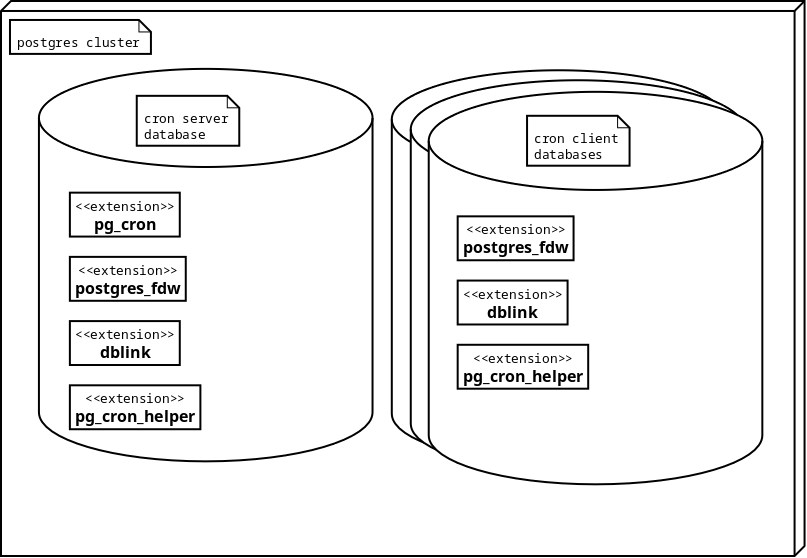

# pg_cron_helper
The pg_cron_helper database extension is supposed to help running "jobs" on a simple time-based schedule. Of course you are far better of using an external scheduler, but if you must schedule jobs inside a Postgres database then this extension may be of some help.
 
Postgres extension pg_cron_helper is a wrapper around the [pg_cron](https://github.com/citusdata/pg_cron) extension. It also depends n contrib extensions postgres_fdw and dblink. Pg_cron_helper "helps" making a job scheduling interface available in more that one database in the Postgres cluster, and it supports a repeat interval that is roughly based on Oracle's repeat_interval definition in dbms_scheduler (altough it doesn't even come anywhere near the possibilities of Oracle's dbms_scheduler package).

## Installation
First make the pg_cron_helper extension available in the Postgres installation directory either using the pgxs infrastructure:<br>
Make sure pg_config is on the PATH and execute '`sudo make install`'<br>
Or:<br>
execute "`select setting from pg_config() where name = 'SHAREDIR';`" in the database to find the *&lt;SHAREDIR&gt;* directory and copy the pg_cron_helper.control and pg_cron_helper--0.1.sql file into the *&lt;SHAREDIR&gt;*/extension directory.

Also make sure that the pg_cron, postgres_fdw and dblink extensions are available in Postgres.

The pg_cron extension needs setting "`shared_preload_libraries = 'pg_cron'`" to be present in the postgresql.conf file (findable via "`select setting from pg_settings where name = 'config_file';`"). Postgres needs to be restarted after adding that setting. See [pg_cron description](https://github.com/citusdata/pg_cron#setting-up-pg_cron).

Then the pg_cron extension must be installed on the cron server database ('postgres' by default -- see the installation instructions of the pg_cron extension).<br>
After installing pg_cron, the pg_cron_helper must be installed in the same cron server database using "`create extension pg_cron_helper cascade;`" ("cascade" makes sure extensions postgres_fdw and dblink are installed as well).

If you want to make pg_cron functionality available in more than one database in the Postgres cluster, then you can install the pg_cron_helper extension in these databases as well. Just execute "`create extension pg_cron_helper cascade;`"



## Interface

### create_job

```
procedure cron.create_job
    ( job_name             varchar(128)
    , job_action           text
    , start_date           timestamp with time zone  default current_timestamp::timestamp(0) with time zone
    , repeat_interval      varchar                   default ''
    , end_date             timestamp with time zone  default null
    , enabled              boolean                   default false
    , auto_drop            boolean                   default true
    , comments             text                      default ''
    , user_name            name                      default current_user
    )
```

**Defines a job.**

**Arguments:**

<style>
table {
    border-collapse: collapse;
}
td {
    border: 1px solid;
    vertical-align: top;
}
</style>
<table>
<tr><td>job_name</td><td>Name of the job to be created. It must be unique (within the user_name).</td></tr>
<tr><td>job_action</td><td>The sql script that is to be executed on behalf of the job. It can consist of one or more sql statements.</td></tr>
<tr><td>start_date</td><td>Normally the creation timestamp of the job. Will be used as base timestamp for intervals. Can be set in the future to have the job started at a later moment.</td></tr>
<tr><td>repeat_interval</td><td>Can be a cron pattern, as described in the <a href="https://github.com/citusdata/pg_cron#what-is-pg_cron">pg_cron</a> extension.<br>Or an Oracle-ish repeat interval - see below.<br>Or it can be left empty, in which case the job can only be run using the cron.run_job() procedure.</td></tr>
<tr><td>end_date</td><td>Timestamp after which the job will be disabled.</td></tr>
<tr><td>enabled</td><td>Directly schedule the job.</td></tr>
<tr><td>auto_drop</td><td>Not implemented yet.</td></tr>
<tr><td>comments</td><td>Just comment.</td></tr>
<tr><td>user_name</td><td>The role under which the job should run. the user_name is part of the unique identification of the job.</td></tr>
</table>

**repeat_interval:**

<table>
<tr><td>FREQ</td><td>Defines the interval unit. Can be one of YEARLY, MONTHLY, WEEKLY, DAILY, HOURLY, MINUTELY or SECONDLY.<br>
The FREQ clause must be defined as first in the repeat-interval definition. If it is SECONDLY, then an INTERVAL clause can be defined, but no others.<br><br>Example:<br>
FREQ=DAILY</td></tr>
<tr><td>INTERVAL</td><td>Defines how many minutes, hours, days ... depending on FREQ must be (at least) between the starts of job runs.<br>
So, for example 'FREQ=SECONDLY;INTERVAL=45' means: every 45 seconds<br>
and 'FREQ=HOURLY;INTERVAL=3' means: every third our.<br>
Defaults to 1.</td></tr>
<tr><td>BYDAY</td><td>Comma separated list of weekdays on which the job is allowed to run. Allowed values : SUN, SUNDAY, 0, MON, MONDAY, 1, TUE, TUESDAY, 2, WED, WEDNESDAY, 3, THU, THURSDAY, 4, FRI, FRIDAY, 5, SAT, SATURDAY, 6.<br>
When the start time of a job + the interval is not in one of the allowed days, then the next run will be postponed to the next allowed day.<br><br>
For example:
'FREQ=HOURLY;BYDAY=MON,TUE,WED,THU,FRI'<br>schedules the job to run every hour on working days</td></tr>
<tr><td>BYHOUR</td><td>Comma separated list of hours (24 hours per day) on which the job is allowed to run.<br><br>
For example:
'FREQ=DAILY;INTERVAL=5,BYDAY=MON,TUE,WED,THU,FRI;BYHOUR=18,19,20'<br>
means: the job is scheduled every fifth day, on working days, somewhere between 18:00 and 20:59.</td></tr>
<tr><td>BYMINUTE</td><td>comma separated list of minutes (0 - 59) within the hour on which a job is allowed to start.</td></tr>
<tr><td>BYMONTHDAY</td><td>Comma separated list of days of month on which a job is allowed to start.<br>Be cautious with nunbers > 28 as they may not appear in every month.<br><br>
So a schedule like<br>
'FREQ=MONTHLY;BYMONTHDAY=29<br>
will cause the job to run every 29'th of the month - so in February only once every four years.</td></tr>
</table>

**Examples:**

```
call cron.create_job( job_name => 'cleanup job'
                    , job_action => $$truncate table my_schema.tbl_a;
                                      truncate table my_schema.tbl_b cascade;
                                      insert into my_schema.admin_log (msg) values ('ran cleanup job.');$$
                    );
                    
```

That creates a job called 'cleanup job', which is not scheduled. So it will only be executed when you execute:<br>
call cron.run_job( job_name => 'cleanup job' );

```
call cron.create_job( job_name => 'every ten minutes on week days'
                    , job_action => 'call my_schema.some_procedure();
                    , repeat_interval => 'FREQ=MINUTELY;INTERVAL=15;BYDAY=MON,TUE,WED,THU,FRI'
                    , enabled => true
                    , comments => 'This is a great job'
                    );
```

Creates a job that will run every 15 minutes on weekdays.

### enable_job

```
procedure cron.enable_job
    ( job_name             varchar(128)
    , user_name            name default current_user
    )
```
**Schedules the job if a repeat_interval is present**

Only a job that has a repeat_inteval can be enabled.

**Arguments:**

<table>
<tr><td>job_name</td><td>Name of the job to schedule.</td></tr>
<tr><td>user_name</td><td>The user name of the job if that is not the current user.</td></tr>
</table>

**Example:**

```
call cron.enable_job(job_name => 'my beautiful job');
```

### disable_job

```
procedure cron.disable_job
    ( job_name             varchar(128)
    , user_name            name default current_user
    )
```
**Unschedules the job**

After running the disable_job procedure, the job is no longer scheduled. A running instance of the job will not be affected - will be allowed to finish normally. But it will not start again automatically. 

**Arguments:**

<table>
<tr><td>job_name</td><td>Name of the job to unschedule.</td></tr>
<tr><td>user_name</td><td>The user name of the job if that is not the current user.</td></tr>
</table>

**Example:**

```
call cron.disable_job(job_name => 'my beautiful job');
```

### run_job

```
procedure cron.run_job
    ( job_name             varchar(128)
    , user_name            name default current_user
    )
```
**Runs the job "now"**

No, in fact: schedules the job to run in five seconds. The reason for that is the fact that pg_cron can only schedule jobs. The five seconds are a safety margin. As soon as the job starts running, it will be unscheduled - or rescheduled according to its defined schedule.

A job can be run at any time, regardless if it is enabled or not. 

**Arguments:**

<table>
<tr><td>job_name</td><td>Name of the job to run.</td></tr>
<tr><td>user_name</td><td>The user name of the job if that is not the current user.</td></tr>
</table>

**Example:**

```
call cron.run_job(job_name => 'my beautiful job');
```

### stop_job

```
procedure cron.stop_job
    ( job_name             varchar(128)
    , force                boolean      default false
    , user_name            name         default current_user
    )
```
**Aborts a running job**

If the job is not running, nothign will happen 

**Arguments:**

<table>
<tr><td>job_name</td><td>Name of the job to stop.</td></tr>
<tr><td>force</td><td>If false (default), the job will be stopped using pg_cancel_backend(). If true then  pg_terminate_backend() will be used. See the [Postgres manual](https://www.postgresql.org/docs/current/functions-admin.html#FUNCTIONS-ADMIN-SIGNAL).</td></tr>
<tr><td>user_name</td><td>The user name of the job if that is not the current user.</td></tr>
</table>

**Example:**

```
call cron.stop_job(job_name => 'my beautiful job', force => true);
```

### drop_job

```
procedure cron.drop_job
    ( job_name             varchar(128)
    , force                boolean      default false
    , user_name            name         default current_user
    )
```
**Deletes a job definition**

**Arguments:**

<table>
<tr><td>job_name</td><td>Name of the job definition to delete.</td></tr>
<tr><td>force</td><td>If true, then stop_job() will be invoked. Else a running instance of the job will be allowed to finish normally.</td></tr>
<tr><td>user_name</td><td>The user name of the job if that is not the current user.</td></tr>
</table>

**Example:**

```
call cron.drop_job(job_name => 'his job', user_name => 'someone_else');
```

### list_jobs

```
function cron.list_jobs()
    returns setof cron.job_record
```

whereby cron.job_record is defined as:

```
type cron.job_record as
    ( job_name             varchar(128) 
    , job_action           text
    , start_date           timestamp with time zone
    , repeat_interval      text
    , end_date             timestamp with time zone
    , enabled              boolean
    , auto_drop            boolean
    , user_name            name
    , comments             text
    )
```

**Just lists all jobs known for this database**

**Example:**

```
select * from  cron.list_jobs();
```

### get_job_state

```
function cron.get_job_state
    ( job_name             varchar(128)
    , user_name            name default current_user
    ) returns text
```
**Returns the current state of a job**

**Arguments:**

<table>
<tr><td>job_name</td><td>Name of the job for which the state is requested.</td></tr>
<tr><td>user_name</td><td>The user name of the job if that is not the current user.</td></tr>
</table>

**Possible return values:**

<table>
<tr><td>'defined'</td><td>The job is known, but not currently scheduled. No information about previous runs is available.</td></tr>
<tr><td>'scheduled'</td><td>The job is scheduled to run.</td></tr>
<tr><td>'running'</td><td>The job is currently executing.</td></tr>
<tr><td>'succeeded'</td><td>The last run was succesful.</td></tr>
<tr><td>'failed'</td><td>The last run ended unsuccesful.</td></tr>
<tr><td>'unknown'</td><td>The job definition is not found.</td></tr>
</table>

**Example:**

```
select cron.get_job_state(job_name => 'my_job');
```

### Other functions and procedures
Functions and procedures that start with \_cron\_ or \_srvr\_ are intended for internal use. Please don't invoke.

## Todo:
The pg_cron_helper extension is still a bit premature. Next things to implement are:

- validations for the create_job procedure
- implement auto_drop
- enhance logging and logging maintenance 
